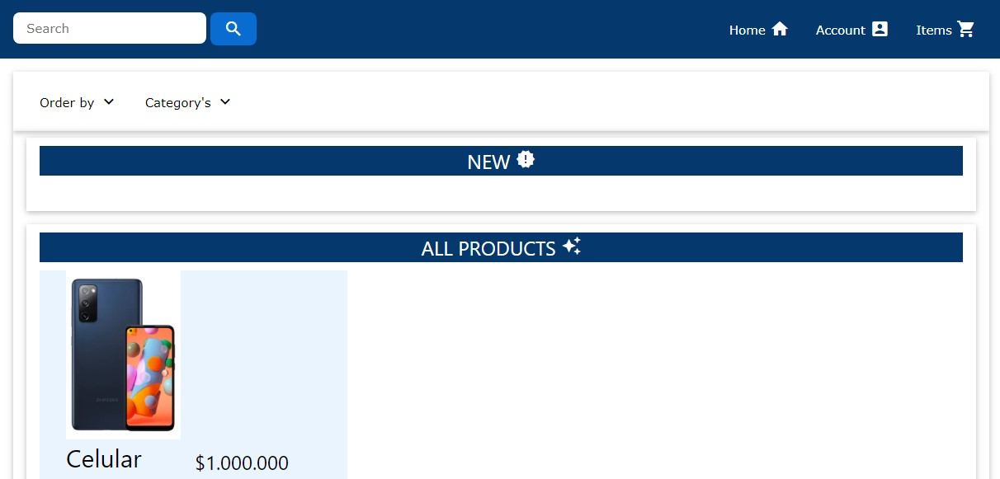

# E-commerce 

E-commerce web application with Java Spring Boot.

The purpose of the project is make a web application similar to 
Facebook Market Place or Mercado Libre, where the user can publish 
items, sell them o buy them.

#### Project status: In progress.

## Image Preview


## Features
### To do:
* Be able to login with a Google or Facebook account.
* Password recuperation with email.
* Can chose your location with Google maps API.
* Responsive design for mobiles.
* Animations for the front-end.
* Docker image for the project.
* Reset password by token.
 
### Done
* Image avatar for users.

 ##### Trello board: https://trello.com/b/feqtm3zG/e-commerce

## Configuration
### Manually
In the archive `application.properties` you have to add the next code:
```
spring.datasource.driver-class-name=com.mysql.cj.jdbc.Driver
spring.datasource.url=jdbc:mysql://${MYSQL_HOST:localhost}:3306/ecommercedb?serverTimezone=UTC
spring.datasource.username=root
spring.datasource.password=

spring.jpa.hibernate.ddl-auto=create-drop
```

Wich is configured in port 3306, in `ecommercedb` database on MySql.

## Technologies
* Java 1.8
* Maven 4.0 
* Spring Boot 2.4.2
* Spring Security
* Spring Data JPA
* Spring Test 
* JUnit 5
* Thymeleaf
* W3 Style
* MySql
* Hibernate ORM 5.4.27
* BCryptPasswordEncoder
* JQuery 3.5.1
* Ajax

